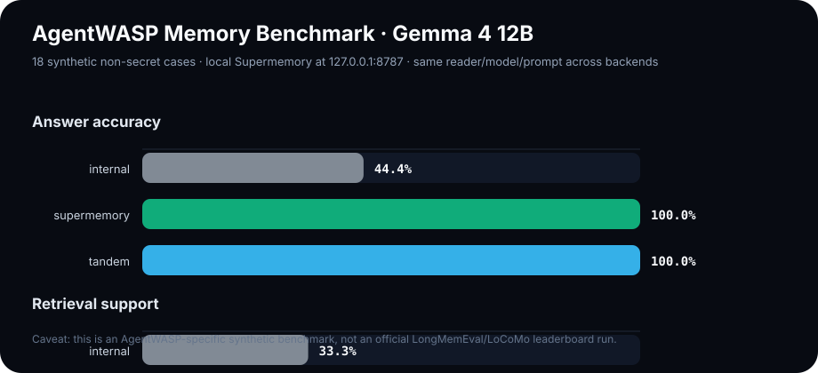

# AgentWASP memory benchmark methodology

This repository includes a local, reproducible benchmark harness for comparing AgentWASP memory backends with a fixed reader model.

## What it compares

The harness compares three context strategies:

| Backend | Meaning |
|---|---|
| `internal` | AgentWASP's local-model lightweight memory behavior: bounded recent chat-scoped episodic context only. |
| `supermemory` | Scoped Supermemory exact-memory ingestion plus `/v4/profile` retrieval. |
| `tandem` | Supermemory context plus the same internal recent episodic context. |

This intentionally measures the memory context that the same reader model sees. It is not an official LongMemEval or LoCoMo leaderboard run.

## Metrics



The benchmark records:

- answer accuracy;
- retrieval support: whether the expected answer was present in the context;
- forbidden answer rate and context contamination;
- unsupported-answer rate;
- context character count and model token usage;
- retrieval latency p50/p95;
- generation latency p50/p95;
- Supermemory seed counts/failures and redacted error samples;
- category breakdowns for long-horizon recall, temporal updates, stale memory, multi-hop, scope isolation, abstention, and distractor robustness.

## Run locally with Gemma on Olympus

```bash
cd containers/agent-core
SUPERMEMORY_BASE_URL="http://127.0.0.1:8787" \
python3 benchmarks/memory_backend_benchmark.py \
  --reader-base-url http://127.0.0.1:8088/v1 \
  --reader-model gemma-4-12b-it-q4km-vulkan-safe \
  --supermemory-base-url http://127.0.0.1:8787 \
  --supermemory-api-key-file /path/to/local/supermemory/api-key \
  --backends internal supermemory tandem
```

Outputs are written under `containers/agent-core/benchmark-results/` as:

- `results.json` — machine-readable full output;
- `results.csv` — spreadsheet-friendly rows;
- `report.md` — summary tables suitable for PR discussion or website drafting.

The harness records Supermemory write failures in `seed_failures` and treats retrieval timeouts as `[SUPERMEMORY CONTEXT UNAVAILABLE]` instead of crashing the full run. This lets internal-only/degraded results still produce a report when a local Supermemory daemon stalls.

## Scientific caveats

- Use paired comparisons: every backend sees the same questions, facts, reader model, decoding settings, and hardware.
- Do not compare these numbers to public benchmark leaderboards unless using their official data, prompts, and judges.
- Keep retrieval and final-answer quality separate. A strong reader can hide weak retrieval, and noisy retrieval can still produce correct answers by luck.
- Report latency and context size next to quality. A memory backend that improves recall but triples p95 latency may not be the right default.
- The included fixture is synthetic and non-secret by design. Real deployment claims should be validated on additional private/user-owned corpora without exposing raw memory contents.
